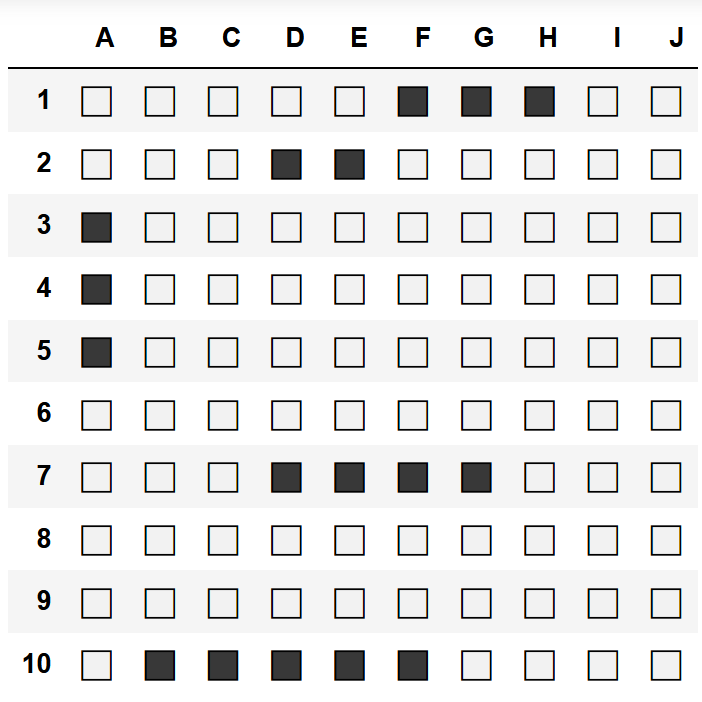
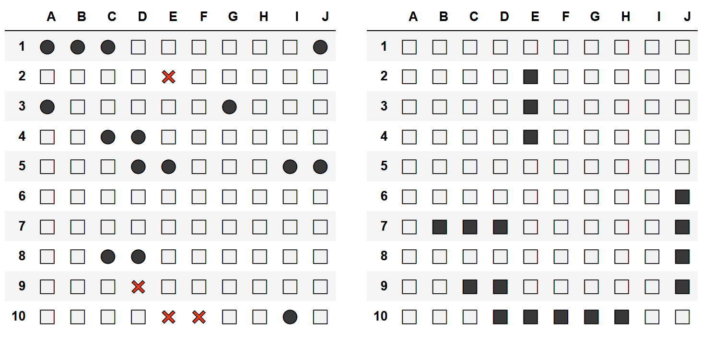

# gym-battleship
Battleship environment using the OpenAI environment toolkit. 

## Basics

Make and initialize an environment:
```
import gym
import gym_battleship
env = gym.make('battleship-v0')
env.reset()
```

Get the action space and the observation space:
```
ACTION_SPACE = env.action_space.n
OBSERVATION_SPACE = env.observation_space.shape[0]
```

Run a random agent:
```
for i in range(10):
    env.step(env.action_space.sample())
```

Observe the hidden game state:
```
print(env.board_generated)
```
## Valid actions

There is two way to input the action.  
The first way is to input the tuple as it is:
```
env = gym.make('battleship-v0')
env.reset()
action = (0, 0)
env.step(action)
```

The second way is to input an encoded action:
```
env = gym.make('battleship-v0')
env.reset()
action = 10
env.step(action)
```

## Customize environments

The original battleship game is played on a 10x10 grid and the fleet is composed 5 ships:  Carrier (occupies 5 spaces), Battleship (4), Cruiser (3), Submarine (3), and Destroyer (2).  

Therefore, the default parameters are :
```
ship_sizes = {5: 1, 4: 1, 3: 2, 2: 1}
board_size = (10, 10)
```

It is possible to change the parameters when making the environment:
```
import gym
import gym_battleship

env = gym.make('battleship-v0', ship_sizes={4: 2, 3: 1}, board_size=(5, 5))
```

The other possible parameters are the different rewards as well as the maximum step:
```
import gym
import gym_battleship

env = gym.make('battleship-v0', episode_steps=10, reward_dictionary={'win': 200})
```

The default reward keys and values are the following:
```
reward_dictionary = {
    'win': 100,
    'missed': 0,
    'touched': 1,
    'repeat_missed': -1,
    'repeat_touched': -0.5
}
```
It is only necessary to pass to the environment the rewards that you want to edit.

## Render

Two functions exist to render the environment:
```
env.render_board_generated()
```
```
env.render()
```
Examples of renders using on an Ipython notebook (`env.render()` on the left and `env.render_board_generated()` on the right)


<details>
    <summary>Code snippet for rendering</summary>

        import gym
        import gym_battleship

        env = gym.make('battleship-v0')
        env.reset()

        for i in range(10):
            env.step(env.action_space.sample())
            env.render()

        env.render_board_generated()
        
</details>

Unfortunately, the pretty print of dataframe in IDE or console will not be as nice as a dataframe displayed in a notebook.

## Requirements

gym  
numpy

## Installation

The command to install the repository via pip is:
```
pip install git+https://github.com/thomashirtz/gym-battleship#egg=gym-battleship
```
